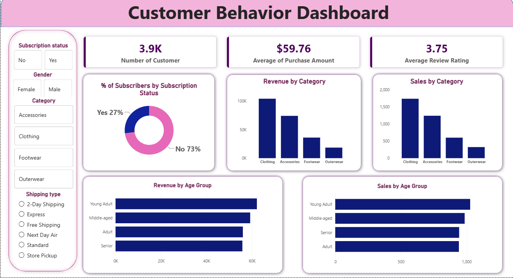

# Customer Behaviour Analysis

## 1. Overview

This project focuses on analyzing customer behaviour to identify purchasing patterns, understand customer preferences, and generate actionable business insights.

The project follows an end-to-end data analytics workflow, starting with data loading and Exploratory Data Analysis (EDA) in Python, followed by data cleaning, SQL-based analysis using PostgreSQL, and interactive dashboard development in Power BI.

A detailed analytical report and presentation are also created to communicate key insights and business recommendations.

**Project Objectives:**

* Understand customer purchasing behaviour and preferences.
* Identify trends in sales, spending, and customer activity.
* Analyze customer segments and purchasing patterns.
* Generate data-driven insights to support business decisions.

## 2. Dataset

The dataset contains customer-related information used to analyze purchasing behaviour and identify meaningful trends.

**Key data attributes may include:**

* Customer ID
* Age and demographic information
* Gender
* Product category
* Purchase amount
* Purchase frequency
* Payment method
* Purchase date
* Customer ratings or satisfaction

*Note: Update the dataset description and attributes based on the actual dataset used in the project.*

## 3. Tools & Technologies

| Tool                 | Purpose                              |
| -------------------- | ------------------------------------ |
| Python               | Data loading, EDA, and data cleaning |
| Pandas & NumPy       | Data manipulation and preprocessing  |
| Matplotlib & Seaborn | Data visualization                   |
| PostgreSQL           | SQL-based data analysis              |
| Power BI             | Interactive dashboard development    |
| Gamma                | Presentation creation                |
| Jupyter Notebook     | Python analysis environment          |

## 4. Project Workflow

### Step 1: Data Loading & Exploratory Data Analysis (EDA)

* Imported the dataset into Python using Pandas.
* Examined the dataset structure, dimensions, and data types.
* Analyzed summary statistics and key variables.
* Explored customer behaviour, spending patterns, and purchase trends.
* Identified initial patterns and potential data quality issues.

### Step 2: Data Cleaning & Preprocessing

* Checked for missing and duplicate values.
* Corrected data types and inconsistent entries.
* Handled missing values and duplicate records where required.
* Standardized column names and categorical values.
* Prepared a clean dataset for further analysis.

### Step 3: SQL Analysis Using PostgreSQL

* Imported the cleaned dataset into PostgreSQL.
* Used SQL queries to analyze customer purchasing behaviour.
* Applied filtering, aggregation, grouping, and joins where applicable.
* Identified customer segments, spending patterns, and product preferences.
* Extracted key metrics to support business insights.

### Step 4: Power BI Dashboard

* Connected Power BI to the analyzed dataset.
* Created interactive visualizations and KPI cards.
* Designed dashboards to explore customer behaviour and purchasing trends.
* Added filters and slicers for interactive analysis.
* Presented key findings in a clear, business-friendly format.

### Step 5: Reporting & Presentation

* Prepared a detailed analytical report summarizing the methodology and findings.
* Documented key insights and potential business recommendations.
* Created a presentation using Gamma to communicate the project outcomes effectively.

## 5. Dashboard

The Power BI dashboard provides an interactive overview of customer behaviour and purchasing trends.

**Key dashboard components:**

* Customer demographics and segmentation
* Total customers and purchase activity
* Average purchase amount and spending patterns
* Product category preferences
* Purchase frequency and customer trends
* Customer ratings or satisfaction, if available




## 6. Results & Business Insights

The analysis aims to uncover actionable insights into customer behaviour, including:

* Customer segments with different purchasing patterns.
* Product categories that attract higher customer spending.
* Trends in purchase frequency and customer activity.
* Relationships between customer demographics and purchasing behaviour.
* Opportunities to improve customer engagement and retention.

## 7. How to Run

### Prerequisites

Install or set up the following tools:

* Python 3.x
* Jupyter Notebook
* PostgreSQL
* Power BI Desktop

### Setup Instructions

**1. Clone the repository**

```bash
git clone <your-repository-url>
cd customer-behaviour-analysis
```

**2. Install the required Python libraries**

```bash
pip install pandas numpy matplotlib seaborn sqlalchemy psycopg2-binary jupyter
```

**3. Load and analyze the dataset**

* Open the Jupyter Notebook.
* Update the dataset path.
* Run the notebook cells to perform EDA and data cleaning.

**4. Set up PostgreSQL**

* Create a PostgreSQL database.
* Import the cleaned dataset into the database.
* Execute the SQL queries provided in the `sql/` folder.

**5. Open the Power BI dashboard**

* Open the `.pbix` file using Power BI Desktop.
* Update the data source connection if required.
* Refresh the data to view the dashboard.

**6. Review the project deliverables**

* Analytical report
* Power BI dashboard
* Gamma presentation

## 8. Project Structure

```text
customer-behaviour-analysis/
│
├── data/
│   ├── raw/
│   └── cleaned/
│
├── notebooks/
│   └── customer_behaviour_analysis.ipynb
│
├── sql/
│   └── customer_analysis_queries.sql
│
├── dashboard/
│   └── customer_behaviour_dashboard.pbix
│
├── reports/
│   └── customer_behaviour_analysis_report.pdf
│
├── presentation/
│   └── customer_behaviour_analysis.pptx
│
├── images/
│   └── customer-behaviour-dashboard.png
│
├── requirements.txt
└── README.md
```

## 9. Deliverables

* Cleaned dataset
* Python notebook with EDA and preprocessing
* PostgreSQL queries for customer analysis
* Interactive Power BI dashboard
* Analytical report with business insights
* Gamma-generated project presentation

## 10. Conclusion

This project demonstrates an end-to-end data analytics workflow by combining Python, SQL, and Power BI to transform raw customer data into meaningful business insights.

It showcases practical skills in data cleaning, exploratory analysis, querying, visualization, and business reporting, with a focus on understanding customer behaviour and supporting data-driven decision-making.

---

**Author:** Sohini Chandra
**Role:** Data Analyst 


